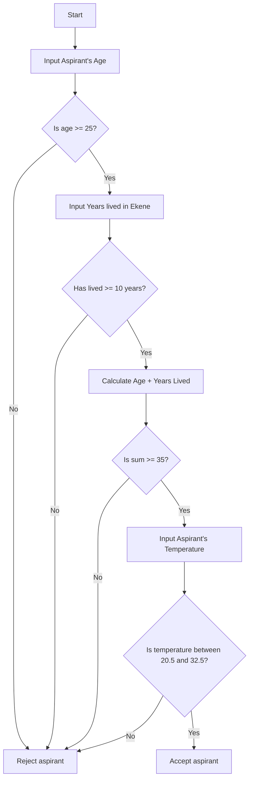

```mermaid
graph TD;
    A[Start] --> B[Input Aspirant's Age];
    B --> C{Is age >= 25?};
    C -- No --> D[Reject aspirant];
    C -- Yes --> E[Input Years lived in Ekene];
    E --> F{Has lived >= 10 years?};
    F -- No --> D;
    F -- Yes --> G[Calculate Age + Years Lived];
    G --> H{Is sum >= 35?};
    H -- No --> D;
    H -- Yes --> I[Input Aspirant's Temperature];
    I --> J{Is temperature between 20.5 and 32.5?};
    J -- No --> D;
    J -- Yes --> K[Accept aspirant];
```
